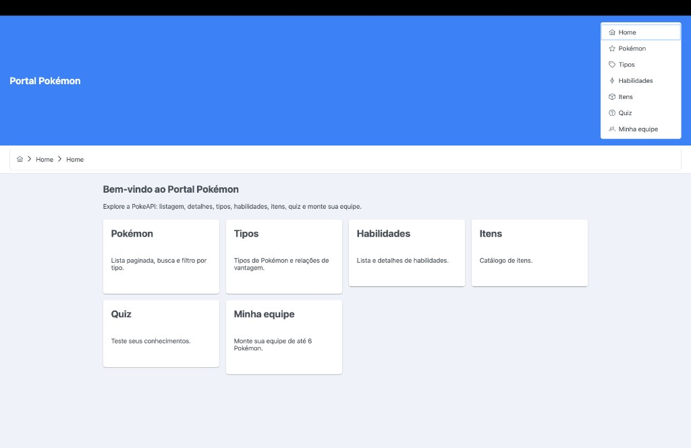
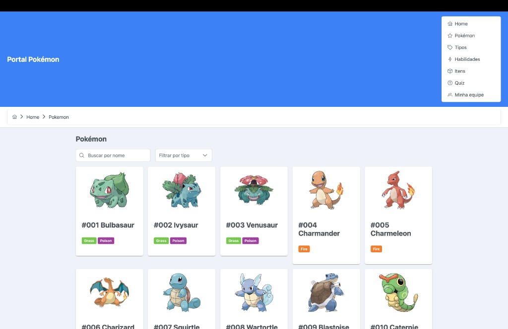
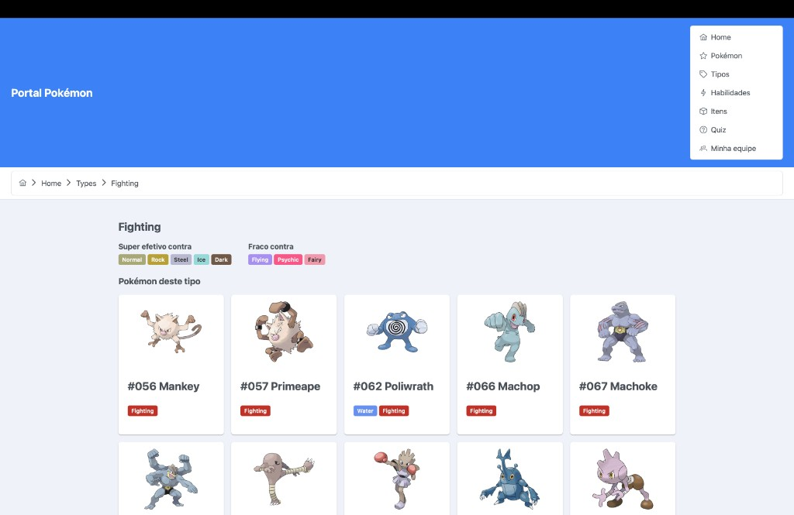
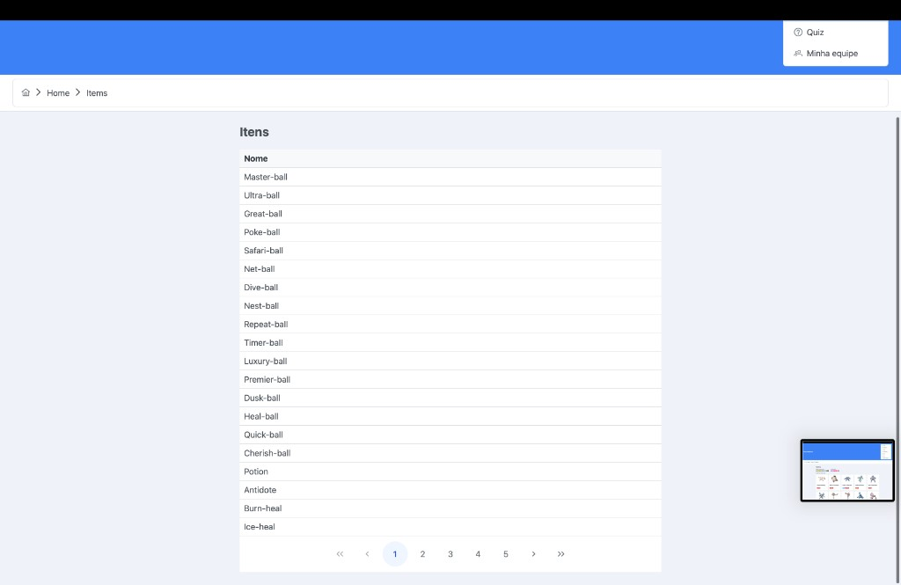
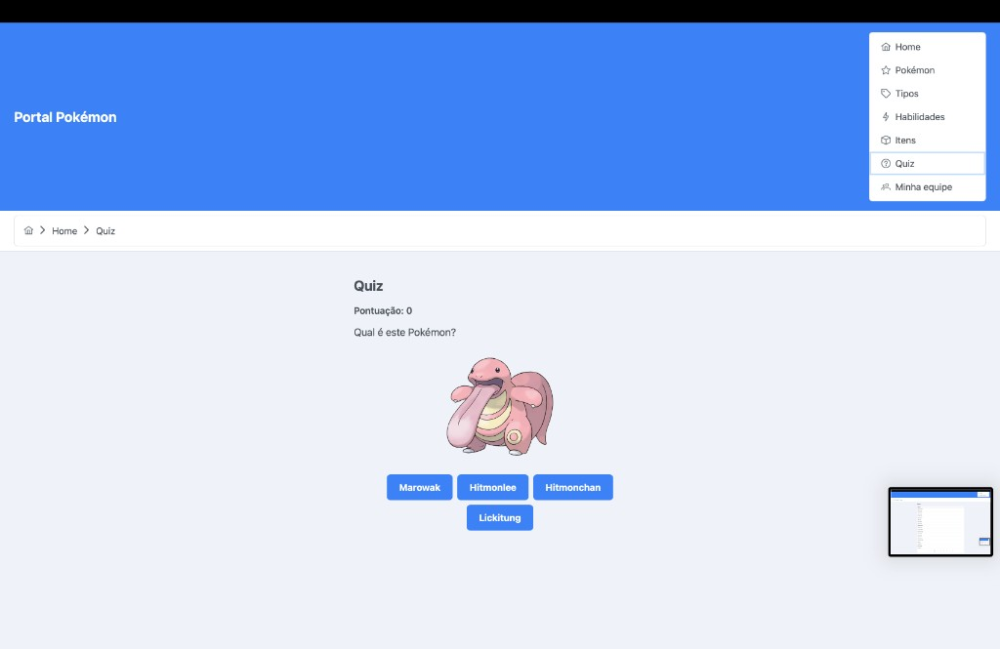

# PortFolio – Portal Pokémon

Aplicação web que consome a [PokeAPI](https://pokeapi.co/) para listar Pokémon, tipos, habilidades, itens, oferecer um quiz e permitir montar uma equipe de até 6 Pokémon.

---

## Português

### Sobre o projeto

O **Portal Pokémon** é um portal web construído com Angular 15 e PrimeNG. O visitante pode navegar por listagens paginadas, buscar e filtrar Pokémon por tipo, consultar detalhes de tipos (vantagens e desvantagens), explorar habilidades e itens, responder a um quiz e montar "Minha equipe" com persistência local.

### Screenshots

| Tela | Captura |
|------|--------|
| **Home** – Bem-vindo ao Portal Pokémon, cards de acesso às seções. |  |
| **Pokémon** – Listagem com busca por nome e filtro por tipo. |  |
| **Tipos** – Página do tipo Fighting: efetividade e Pokémon do tipo. |  |
| **Itens** – Catálogo de itens com paginação. |  |
| **Quiz** – Pergunta "Qual é este Pokémon?" com múltipla escolha. |  |

### Funcionalidades

- Listagem paginada de Pokémon com busca por nome e filtro por tipo.
- Detalhes de cada Pokémon (estatísticas, tipos, habilidades, evoluções).
- Tipos de Pokémon e relações de vantagem/desvantagem.
- Lista e detalhes de habilidades.
- Catálogo de itens com paginação.
- Quiz para testar conhecimentos sobre Pokémon.
- Minha equipe: montar e salvar uma equipe de até 6 Pokémon (persistência local).

### Stack técnica

- **Angular 15** – framework
- **PrimeNG 15** – componentes de UI (tabelas, cards, menu, breadcrumb, etc.)
- **TypeScript** – tipagem
- **SCSS** – estilos
- **PokeAPI** – fonte de dados REST

### Como rodar

```bash
cd portal-pokemon
npm install
ng serve
```

Acesse [http://localhost:4200/](http://localhost:4200/).

### Como gerar o PDF do backlog

1. **Pelo Node** (gera `docs/backlog-portal-pokemon.pdf`):
   ```bash
   npm install
   npm run pdf:backlog
   ```
   Na primeira vez, a geração pode demorar alguns minutos (download do Chromium).

2. **Pelo navegador:** abra `docs/backlog-portal-pokemon.html` e use **Arquivo → Imprimir → Salvar como PDF**.

### Estrutura do repositório

| Pasta / arquivo | Descrição |
|-----------------|-----------|
| `portal-pokemon/` | Aplicação Angular do Portal Pokémon. |
| `docs/` | Backlog (Markdown, HTML, PDF), screenshots e documentação (Git, histórico). |

### Documentação

- [Backlog do produto](docs/backlog-portal-pokemon.md) (Markdown)
- [Backlog em HTML](docs/backlog-portal-pokemon.html) (visualização e impressão)
- [README do app](portal-pokemon/README.md) – estrutura de pastas e comandos do Angular
- [Documentação em `docs/`](docs/README.md) – PDF do backlog, fluxo Git, histórico de evoluções

---

## English

### About the project

**Portal Pokémon** is a web portal built with Angular 15 and PrimeNG. Visitors can browse paginated listings, search and filter Pokémon by type, view type details (strengths and weaknesses), explore abilities and items, take a quiz, and build "My team" with up to 6 Pokémon (local persistence).

### Screenshots

| Screen | Capture |
|--------|---------|
| **Home** – Welcome to the Pokémon Portal, access cards for each section. |  |
| **Pokémon** – Listing with name search and type filter. |  |
| **Types** – Fighting type page: effectiveness and Pokémon of that type. |  |
| **Items** – Items catalog with pagination. |  |
| **Quiz** – "What is this Pokémon?" multiple-choice question. |  |

### Features

- Paginated Pokémon listing with name search and type filter.
- Details for each Pokémon (stats, types, abilities, evolution chain).
- Pokémon types and advantage/disadvantage relationships.
- Abilities list and details.
- Items catalog with pagination.
- Quiz to test your Pokémon knowledge.
- My team: build and save a team of up to 6 Pokémon (local persistence).

### Tech stack

- **Angular 15** – framework
- **PrimeNG 15** – UI components (tables, cards, menu, breadcrumb, etc.)
- **TypeScript** – typing
- **SCSS** – styles
- **PokeAPI** – REST data source

### How to run

```bash
cd portal-pokemon
npm install
ng serve
```

Open [http://localhost:4200/](http://localhost:4200/).

### How to generate the backlog PDF

1. **Via Node** (generates `docs/backlog-portal-pokemon.pdf`):
   ```bash
   npm install
   npm run pdf:backlog
   ```
   The first run may take a few minutes (Chromium download).

2. **Via browser:** open `docs/backlog-portal-pokemon.html` and use **File → Print → Save as PDF**.

### Repository structure

| Path | Description |
|------|-------------|
| `portal-pokemon/` | Angular application for the Pokémon Portal. |
| `docs/` | Backlog (Markdown, HTML, PDF), screenshots, and documentation (Git, history). |

### Documentation

- [Product backlog](docs/backlog-portal-pokemon.md) (Markdown)
- [Backlog in HTML](docs/backlog-portal-pokemon.html) (view and print)
- [App README](portal-pokemon/README.md) – folder structure and Angular commands
- [Documentation in `docs/`](docs/README.md) – backlog PDF, Git workflow, evolution history
